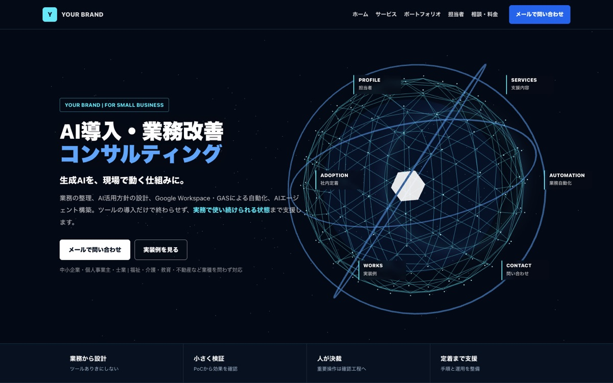

# Business AI Website Template

AI導入・業務改善コンサルティング事業向けの、複数ページ型Webサイトテンプレートです。ホームの3D表示、ページ別ビジュアル、ポートフォリオ、問い合わせフォーム、SEO用構造化データまで含まれています。

元サイトで使われていた完成動画は含まれていません。初期状態は静止画で表示され、付属プロンプトから自分の事業に合う動画を生成できます。



*テンプレートをローカルで起動した実画面です。屋号、担当者、料金、実績、リンクは公開前に自分の内容へ差し替えます。*

## このテンプレートで解決できる悩み

- 何を載せればよいか分からず、ホームページ作成が止まっている
- スマートフォン、問い合わせフォーム、検索設定を一から組むのが難しい
- AIへ毎回同じ事業情報を説明せず、質問に答えながら作りたい
- 実績や制作例をGitHubとつないで見せたい

## どんな人向けか

AI活用支援、業務改善、業務ツール制作などを行う個人事業主や小規模事業者を想定しています。コードを書かず、Claude CodeやCodexの案内を受けながら自分のサイトを作りたい初心者にも利用できます。

## できること

- ホーム、サービス、ポートフォリオ、担当者、相談・料金などの複数ページ表示
- PC・スマートフォン向けの表示
- 匿名フォームIDを使ったメール問い合わせ
- title、description、OGP、canonical、JSON-LD、sitemap、robotsの基本設定
- 公開用ファイルだけを `dist/` へ出力するビルド
- 画面幅ごとの自動表示検査と、公開前のダミー情報検査
- 自分の画像からページ用動画を作るための生成プロンプト

## できないこと・現在の制限

- 屋号、文章、料金、実績、画像を自動で事実確認することはできません
- 予約、決済、会員管理、管理画面は含まれていません
- 生成用プロンプトは付属しますが、完成動画そのものは含みません
- 法務ページの内容は、事業内容や地域に合わせた確認が必要です
- 公開後の集客や検索順位を保証するものではありません

## 実際の利用例

テンプレートをClaude CodeまたはCodexで開き、屋号、支援内容、料金、問い合わせ先、公開URLを質問に答えながら差し替えます。ローカルのPC・スマートフォン表示を確認し、ダミー情報と秘密情報の検査後に自分のCloudflare Pagesへ公開します。

## 導入前と導入後

| 導入前 | 導入後 |
|---|---|
| 白紙からページ構成を考える | 必要なページと導線が入った状態から編集 |
| PCとスマホを目視だけで確認 | 複数画面幅の自動表示検査を実行 |
| 公開ファイルを手作業で選ぶ | `dist/` に公開対象だけを生成 |
| ダミー情報の消し忘れが不安 | readinessコマンドで公開前に検査 |

## 仕組み

```text
利用者が質問へ回答
        ↓
Claude Code / Codexが変更内容を説明
        ↓
HTML・CSS・画像・検索設定を編集
        ↓
ビルド → 自動表示検査 → 人が画面確認
        ↓
利用者の承認後にCloudflare Pagesへ公開
```

## 利用の流れ

1. 「Use this template」から自分用のリポジトリを作ります。
2. Claude CodeまたはCodexでフォルダを開きます。
3. AIからの質問に答え、屋号、文章、料金、画像、リンクを差し替えます。
4. ローカルでPC・スマートフォン表示と問い合わせ導線を確認します。
5. ビルド、テスト、ダミー情報・秘密情報の検査を実行します。
6. 利用者が最終画面を確認してから、自分のCloudflare Pagesへ公開します。


## 初心者の方へ

このテンプレートはClaude Codeにフォルダを読み込ませるだけで、質問に答えながらサイトを作れる構成です。

1. GitHubの「Use this template」から自分のリポジトリを作ります。
2. 作成したリポジトリをパソコンへダウンロードします。
3. フォルダをClaude Codeで開きます。
4. 次の一文を送ります。

```text
サイト作成を始めてください
```

Claude Codeはルートの `CLAUDE.md` を読み、初心者向けの言葉で必要事項を順番に確認します。コードを自分で編集する必要はありません。詳しくは [START_HERE.md](START_HERE.md) を参照してください。

## Claude Code・Codex用スキル

同じ制作ワークフローを、両方のツール用に収録しています。

- Claude Code: `.claude/skills/customize-business-ai-website/SKILL.md`
- Codex: `.agents/skills/customize-business-ai-website/SKILL.md`

通常は「サイト作成を始めてください」で自動的に利用されます。明示的に指定する場合、Claude Codeでは `/customize-business-ai-website`、Codexでは `$customize-business-ai-website` を使用します。どちらも初心者への聞き取り、編集、個人情報保護、表示検査、公開前確認まで案内します。

## 主な機能

- PC・スマホ対応の複数ページ構成
- 1画面に収まるホームと遅延読み込みされるThree.jsの3D表示
- サービス、ポートフォリオ、担当者、問い合わせ・料金ページ
- 静止画から始め、必要な場合だけ動画へ変更できるページ構成
- FormSubmitを使ったメール問い合わせフォーム
- title、description、OGP、canonical、JSON-LD、sitemap、robots
- 公開ファイルだけを `dist/` に出力する安全なビルド
- PC・スマホ10画面の自動表示検査
- Geminiへ参照画像と一緒に渡す動画生成プロンプト4本

## 必ず差し替える項目

Claude Codeが案内しますが、手動で確認する場合は以下を検索してください。

| 検索する文字 | 差し替える内容 |
|---|---|
| `YOUR BRAND` | 屋号・会社名 |
| `YOUR NAME` / `山田 太郎` | 担当者名 |
| `https://example.com` | 公開予定のURL |
| `YOUR_GITHUB_USERNAME` | GitHubユーザー名 |
| `YOUR_FORMSUBMIT_FORM_ID` | FormSubmitの匿名フォームID |
| `YOUR LAST UPDATED DATE` | 法務ページの更新日 |
| `assets/profile-placeholder.jpg` | 自分のプロフィール画像 |

公開準備の残りは次のコマンドで確認できます。

```sh
npm run readiness
npm run readiness -- --strict
```

`--strict` はダミー情報が残っていると公開を止めます。

## 手動で起動する場合

Node.js 20以降を使用します。

```sh
npm install
npx playwright install chromium
npm run dev
```

ブラウザで `http://127.0.0.1:8032` を開きます。表示検査は次の1コマンドです。

```sh
npm test
```

## 問い合わせフォーム

初期状態のフォームはダミーIDのため送信できません。FormSubmitで受信先を認証し、発行された匿名IDを `YOUR_FORMSUBMIT_FORM_ID` と置き換えてください。実メールアドレス、APIキー、パスワードはHTMLやGitHubへ保存しないでください。

## 動画を作り直す

[docs/video-prompts](docs/video-prompts/) に、参照画像をGeminiへ読み込ませた後に追加する4本のプロンプトがあります。完成動画は `source-videos/` に置き、FFmpegが入った環境で次を実行します。

```sh
bash scripts/compress-videos.sh
```

PC用とスマホ用のMP4・WebMが `assets/videos/` に生成されます。

生成と圧縮が終わったら、Claude Codeへ次のように伝えてください。

```text
生成した動画を各ページの静止画と差し替えてください。PC・スマホ対応、動画停止ボタン、表示検査まで進めてください。
```

## Cloudflare Pagesへ公開する

最初にCloudflare側で空のPagesプロジェクトを作成します。プロジェクト名を指定して公開します。

```sh
CLOUDFLARE_PROJECT_NAME=your-project-name npm run deploy
```

リポジトリのルートではなく、必ずビルドで生成された `dist/` だけが公開されます。

## 管理画面について

このテンプレートに管理画面はありません。GitHubトークンをブラウザへ入力する仕組みも含めていません。更新はClaude Codeまたは通常のコード編集とGitで行います。

## 公開前の注意

- プロフィール、実績、料金、外部リンクを実際の内容へ変更してください。
- プライバシーポリシーと特定商取引法表記は、事業内容と地域の法令に合わせて専門家へ確認してください。
- 付属画像・ポスターはデモ表示用です。商用公開前に利用権を確認し、自分で用意した素材への差し替えを推奨します。
- 生成AIの出力や自動化処理には、人が確認する工程を設けてください。

## 使用技術

HTML、CSS、Vanilla JavaScript、Node.js（ESM）、Three.js、Playwright、Cloudflare Pagesを使用しています。フレームワーク固有の知識がなくても、ファイル単位で内容を確認できる構成です。

## セキュリティ

- APIキー、GitHubトークン、Cloudflareトークンをブラウザやリポジトリへ保存しません。
- 問い合わせフォームは実メールアドレスではなく匿名フォームIDを使う前提です。
- `npm run readiness -- --strict` でダミー情報、個人情報、未設定URLを確認してから公開します。
- AIはデプロイ、外部送信、削除の直前に利用者へ確認し、最終画面は人が確認します。

## 無料版とPro版

| 無料版 | Pro版 |
|---|---|
| この公開テンプレート。ページ、ビルド、表示検査、AI向け案内を利用できます | 業種別の文章・画像・公開支援をまとめた版を検討中です。現在は準備中で、購入リンクや価格はありません |

自分の事業内容に合わせた文章整理、画像制作、公開設定、操作説明は別料金の相談として対応します。

## 関連リンク

- [タクミAIサポート公式サイト](https://business-ai-lp.pages.dev/)
- [制作記録・無料記事（note）](https://note.com/mikta17ace94)
- [ホームページ制作・カスタマイズを相談する](https://business-ai-lp.pages.dev/contact#email)

## License

ソースコードは [MIT License](LICENSE) です。デモ用メディアについては [NOTICE.md](NOTICE.md) も確認してください。
